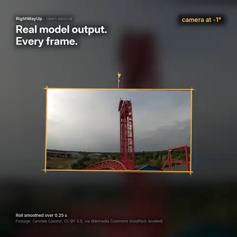

# RightWayUp

**Full-circle image roll estimation with calibrated abstention.** An open model by
[ORTUS AI](https://ortusai.io), the team behind [CHEQIT](https://cheqit.ortusai.io/?utm_source=rightwayup&utm_medium=model_card&utm_campaign=rightwayup-launch) camera-health monitoring.
*Find the right way up, or recognise when the image doesn't define one.*



[Video and write-up](https://cheqit.ortusai.io/resources/rightwayup/) ·
[Code](https://github.com/ortusaitech/rightwayup) ·
[Weights](https://huggingface.co/ortusai/rightwayup) ·
[PyPI](https://pypi.org/project/rightwayup/) · Apache-2.0, commercial use allowed

**Official sources:** the four links above and the ORTUS AI website, [ortusai.io](https://ortusai.io), are the only
official RightWayUp sources. Other websites and apps that use RightWayUp are run independently of ORTUS AI.

RightWayUp estimates how far an image is rotated from upright, over the full 360° at 1° resolution, from a single
image. It returns the angle, a confidence score and an abstain flag, and it can write a corrected copy. The abstain
thresholds were fixed on calibration data only, separately for every file format. It runs on CPUs, NVIDIA GPUs,
Apple silicon and in web browsers, with ONNX (FP32, FP16, INT8) and Core ML files for every tier.

Frozen weights (hashes in `FREEZE.md`). All numbers on this card come from `RESULTS.md`, `results/heldout-rescore/RESULTS.md`
and `benchmarks/HARDWARE-summary.md`; method and caveats in full: `TECHNICAL-REPORT.md`.

## Tiers

All six tiers ship in one Hugging Face repository, [ortusai/rightwayup](https://huggingface.co/ortusai/rightwayup).

| Tier | What runs | Input | Sent to Max (calibration) | New COCO photos¹ (2,201) | New Open Images photos¹ (2,505) | Unseen CCTV² (380) | GPU³ | CPU⁴ |
|---|---|---|---|---|---|---|---|---|
| **Pico** | ViT-S/14, fill-drop | 70 px | — | not in sealed test⁵ | not in sealed test⁵ | 80.0% | 0.55 ms | 3.21 ms |
| **Nano** | ViT-S/14, fill-drop | 112 px | — | 87.3% | 75.5% | 92.6% | 0.55 ms | 7.73 ms |
| **Fast** | ViT-S/14 (distilled from Max), fill-drop | 224 px | — | 90.4% | 84.5% | 97.9% | 0.68 ms | 29.7 ms |
| **Balanced** | Fast → Max cascade | 224 → 280 px | ~10% | 94.0% | 89.1% | 98.4% | 1.77 ms | 62.2 ms |
| **Pro** | Fast → Max cascade | 224 → 280 px | ~20% | 95.5% | 90.5% | 99.2% | 2.29 ms | 94.8 ms |
| **Max** | ViT-L/14 on every image | 280 px | every image | **95.6%** | **90.7%** | **100.0%** | 5.19 ms | 326 ms |
| *Woehrer 2026 (reference)* | MambaOut-base | 224 px | — | 93.6% | 83.8% | 75.0% | 4.04 ms | 161 ms (FP32) |

Within 10°, every image answered. ¹ Sealed final holdout, opened once after the weights were frozen and scored once
(section below). ² Four MEVA CCTV cameras incl. a thermal one, held out since 24 Sep and re-used once for the release
(second use; disclosures below). ³ One image (batch 1), NVIDIA RTX PRO 4500, TensorRT FP16; Pico, Nano and Fast with their
one-image files; Balanced and Pro derived at the 10% / 20% calibration route share. ⁴ One image, laptop Intel Core
i7-1260P, ONNX Runtime INT8, 4 threads (Woehrer 2026: FP32). ⁵ Pico was chosen after the sealed holdout had been
opened; it has development numbers only.

**Fill-drop:** the small models (Pico, Nano, Fast) drop the letterbox padding tokens before the transformer, so a
non-square image costs less. **Cascade:** Balanced and Pro run Fast on every image and pass the least-confident ones
to Max; how many depends on your images (on the sealed test sets: 10–33% for Balanced, 30–80% for Pro, more on
photos and thermal than on the calibration mix), which changes their average cost.

**Which tier?** Max for the best accuracy; Pro or Balanced when most images are easy and you want most of Max's
accuracy for a fraction of its cost; Fast as a quick general default; Nano for camera fleets and edge devices; Pico
for web browsers and very small CPUs (it is the least accurate tier). Nano and Fast trail Woehrer 2026 on clean
COCO photos; their strength is degraded CCTV and thermal footage (tables below).

## Quick start

```bash
pip install rightwayup
rightwayup predict frame.jpg                          # angle_cw, confidence, abstain
rightwayup fix photo.jpg --snap 90 --out upright/     # writes the upright image; leaves it alone if it abstains
rightwayup predict frames/*.jpg --tier nano --batch   # batch-capable files for throughput
```

```python
from PIL import Image
from rightwayup import Orienter

o = Orienter(tier="max")                 # pico | nano | fast | balanced | pro | max; files download on first use
r = o.predict("frame.jpg")               # r.angle_cw, r.confidence, r.abstain, r.routed
upright = o.correct(Image.open("photo.jpg"), snap=90)
rs = Orienter(tier="nano", batch=True).predict_batch(["a.jpg", "b.jpg"], batch_size=64)
```

`angle_cw` is the clockwise rotation of the image content; rotating the image counter-clockwise by `angle_cw`
makes it upright. `routed` is true when a cascade tier passed the image to Max. `abstain` is true when the image has
no reliable "up" (bare walls, sky, texture, straight-down aerial views); the angle is still reported. Options:
`device` (`auto`, `cpu`, `cuda`, `tensorrt`, `coreml`), `precision` (`auto` = INT8 on CPU, FP16 on GPU; or `fp32`,
`fp16`, `int8`), `abstain` (`standard`, `strict`, `off`), `batch` (one-image files by default; `True` for the
batch-capable files, same answers) and `model_dir` (run offline from a folder of files). The package applies the
thresholds of the file format it loads.

## Sealed final holdout (frozen weights, opened once, scored once, 29 Sep 2026)

Weights, tiers and thresholds were frozen first (`FREEZE.md`, 29 Sep 11:19 Sydney time). The holdout sets had never
been trained on, used for model choice, or rendered before the freeze. They were then opened once and scored once,
with identical pixels for every model. Within 10°, every image answered; in brackets the paired difference to
Woehrer 2026 in images with its 95% bootstrap interval (**bold** = significant).

| Test (images) | Woehrer 2026 | Max | Pro | Balanced | Fast | Nano |
|---|---|---|---|---|---|---|
| New COCO photos (2,201) | 93.6% | **95.6% (+45 [+19, +71])** | **95.5% (+41 [+14, +68])** | 94.0% (+8 [−20, +36]) | **90.4% (−70 [−100, −41])** | **87.3% (−138 [−171, −106])** |
| same, max-area crop | 94.1% | 95.3% (+25 [−1, +50]) | 95.0% (+20 [−6, +46]) | 93.2% (−21 [−49, +7]) | **90.2% (−87 [−116, −58])** | **88.0% (−136 [−167, −105])** |
| same, simulated CCTV degradation | 54.7% | **92.5% (+831)** | **92.4% (+829)** | **91.6% (+812)** | **89.3% (+760)** | **86.5% (+699)** |
| New Open Images photos (2,505) | 83.8% | **90.7% (+174 [+135, +214])** | **90.5% (+168 [+128, +209])** | **89.1% (+134 [+93, +175])** | 84.5% (+17 [−25, +59]) | **75.5% (−207 [−254, −160])** |
| same, simulated CCTV degradation | 44.5% | **84.4% (+1000)** | **84.1% (+991)** | **83.2% (+969)** | **78.9% (+861)** | **73.5% (+727)** |
| R-LiViT traffic camera, RGB (74) | 98.6% | 97.3% (−1 [−5, +2]) | 93.2% (−4 [−9, +0]) | **87.8% (−8 [−14, −2])** | **87.8% (−8 [−14, −2])** | **77.0% (−16 [−24, −8])** |
| R-LiViT traffic camera, thermal (74) | 37.8% | **95.9% (+43)** | **95.9% (+43)** | **95.9% (+43)** | **90.5% (+39)** | **74.3% (+27)** |
| Aalborg thermal camera (150) | 57.3% | **83.3% (+39 [+24, +54])** | **78.0% (+31 [+16, +46])** | **68.7% (+17 [+2, +32])** | 61.3% (+6 [−8, +20]) | 48.7% (−13 [−29, +3]) |

- On the 4,706 new photos (COCO + Open Images), Max scores 93.0% against 88.4% for Woehrer 2026, with 33 against 185
  upside-down answers (≥150° off). With simulated CCTV degradation: 88.2% against 49.3%. On the two thermal cameras
  (224 images, a small sample): 87.5% against 50.9%.
- Max beats Woehrer 2026 significantly on 6 of the 8 panels and ties on the other two (max-area crop, R-LiViT RGB).
- "Simulated CCTV degradation" means the same views passed through our CCTV-style degradations (resolution loss,
  blur, IR/greyscale, exposure, noise, JPEG), not recordings from degraded cameras. Intervals for every cell:
  `RESULTS.md` §0 and `results/sealed-holdout/FINAL-PAIRED.json`.

## Held-out CCTV and scene tests (second use, 30 Sep 2026)

The two test sets that scored the superseded 24 Sep weights were re-scored once with the release files after a
pre-registration (`results/heldout-rescore/PREREG.md`). The released models never trained on them.

| Held-out set (views) | Woehrer 2026 | Deep-OAD | GeoCalib | Pico | Nano | Fast | Balanced | Pro | Max |
|---|---|---|---|---|---|---|---|---|---|
| **Four unseen MEVA CCTV cameras** incl. thermal G474 (380) | 75.0% (47) | 82.4% (26) | 23.9% (86) | 80.0% (21) | 92.6% (21) | 97.9% (8) | 98.4% (6) | 99.2% (3) | **100.0% (0)** |
| of which thermal camera G474 (110) | 53.6% (47) | 67.3% (26) | 20.9% (29) | 86.4% (14) | 89.1% (12) | 93.6% (7) | 94.5% (6) | 97.3% (3) | **100.0% (0)** |
| **Clean scene test**: DIODE scene 12, MEVA G339, Poly Haven renders (2,854) | 70.6% (98) | 82.8% (113) | 25.0% (749) | 96.5% (11) | 98.0% (7) | 97.8% (10) | 98.0% (6) | 98.7% (5) | **98.8% (5)** |

Within 10°, every view answered; upside-down errors (≥150°) in brackets. Max − Woehrer 2026: +95 views [+77, +113]
(four cameras) and +806 [+754, +858] (clean test); Max − Deep-OAD: +67 [+52, +82] and +459 [+413, +506]. Views are
clean plus simulated degradation of the same frames. GeoCalib is a calibration model built for about ±45° of roll and
cannot represent sideways or upside-down images, which explains most of its full-circle score.

Both sets were first used on 24 Sep to score the earlier weights, so this is their second use. MEVA cameras G331 and
G639 were in a development set of the release, so the held-out figure uses the other four (all six, 560 views: Max
100.0%). Comparator rows are the stored 24 Sep predictions on identical pixels. Full tables:
`results/heldout-rescore/RESULTS.md`.

## RotBench (independent benchmark with a human baseline, 30 Sep 2026)

[RotBench](https://huggingface.co/datasets/tianyin/RotBench) (data Apache-2.0) turns photos 0°, 90°, 180° and 270°; the score is
4-way accuracy per rotation, official protocol. The release files were scored once after a pre-registration
(`results/rotbench/PREREG.md`); the benchmark is public and was also used for our earlier candidate.

| RotBench-Small (50 photos) | 0° | 90° | 180° | 270° |
|---|---|---|---|---|
| Humans (as published by RotBench) | 0.99 | 0.99 | 0.99 | 0.97 |
| GPT-5 / Gemini 2.5 Pro / o3 (as published) | 1.00 | 0.41–0.50 | 0.70–0.81 | 0.40–0.59 |
| Woehrer 2026 | 0.90 | 0.92 | 0.88 | 0.88 |
| Deep-OAD | 0.94 | 0.82 | 0.86 | 0.78 |
| RightWayUp Pico / Nano / Fast | 0.94–0.98 | 0.92–0.98 | 0.90–0.96 | 0.92–0.98 |
| RightWayUp Balanced | 1.00 | 0.98 | 0.98 | 0.98 |
| **RightWayUp Pro and Max** | **1.00** | **1.00** | **1.00** | **1.00** |

Max and Pro answer every RotBench image correctly, on RotBench-Small and on RotBench-Large (300 photos; Woehrer 2026
0.97 mean, Deep-OAD 0.93), with no upside-down answers. On RotBench-Small that is above the published human baseline
(0.99 / 0.99 / 0.99 / 0.97), by 1–3 points on 50 photos. All rows and splits: `results/rotbench/RESULTS.md`.

## Development results (used for model choice; Pico included)

| Test (images) | Woehrer 2026 | Max | Pro | Balanced | Fast | Nano | Pico |
|---|---|---|---|---|---|---|---|
| Woehrer 2026's own benchmark, 5 angle seeds (5,150) | 98.0% | 98.8% | 98.7% | 97.7% | 96.5% | 96.0% | 92.2% |
| same, each view saved once as JPEG q90 | 30.2% | 98.4% | 98.2% | 97.5% | 96.4% | 95.9% | 92.2% |
| Realistic photos, cue-free rendering (1,856) | 77.6% | 83.6% | 83.5% | 81.8% | 76.3% | 74.2% | 70.0% |
| same, camera JPEG | 23.2% | 81.1% | 80.9% | 79.2% | 74.8% | 73.9% | 69.9% |
| MEVA development cameras, real CCTV (646) | 77.5% | 99.8% | 99.8% | 99.7% | 98.8% | 98.0% | 96.4% |
| Common mixed CCTV-like (1,200) | 25.7% | 96.7% | 96.2% | 95.6% | 93.9% | 93.2% | 91.8% |
| Fresh DIODE scenes (300) | 28.0% | 98.3% | 97.3% | 95.0% | 91.3% | 89.7% | 86.0% |
| Fair photos (1,030) | 97.2% | 99.0% | 98.8% | 98.5% | 96.9% | 94.8% | 91.9% |

Within 10°, every image answered. On Woehrer 2026's benchmark we report the five-seed mean, as its paper does
(Max − Woehrer 2026: +41 images [8, 76] over 5,150 views). The JPEG q90 row saves each benchmark view once as an
ordinary JPEG; Woehrer 2026 then snaps most answers to the nearest multiple of 90°. We think the rotated JPEG
block grid of the source photos carries part of the angle on that benchmark (`TECHNICAL-REPORT.md` §5; notes and
reproduction script: `benchmarks/woehrer-2026/`). "Cue-free rendering" re-renders photos the way a physically rolled
camera sees them (§ on the grid fix below). Full development tables: `RESULTS.md` §2–§3.

## Abstention

Thresholds are fixed on calibration data only (MEVA, Poly Haven and Open Images calibration sets, equal weight), for
every file format separately, and then applied unchanged. **Standard** answers about 90% of calibration images;
**strict** is the lowest threshold with at most 1% wrong answers on calibration data, and never looser than standard.

On the sealed holdout at the standard setting, Max answers 91% of the new COCO photos with 2.1% wrong among its
answers, and 74% of the new Open Images photos with 1.2% wrong. On the four held-out CCTV cameras it answers 99.7% of
the views, all correctly; on the clean scene test it answers 97.7% with 99.7% correct. Every tier and both operating
points: `RESULTS.md` §4 and `results/heldout-rescore/RESULTS.md`.

**Thermal images:** confidence is not reliable there. On the unseen Aalborg thermal camera, Max answers 80% at the
standard setting with 12.5% wrong (Nano 77% with 50% wrong), and the strict setting doesn't fix it.

## Speed

| Platform (runtime) | Pico | Nano | Fast | Balanced (derived) | Pro (derived) | Max | Woehrer 2026 |
|---|---|---|---|---|---|---|---|
| RTX PRO 4500 (TensorRT FP16), single image | 0.55 ms | 0.55 ms | 0.68 ms | 1.77 ms | 2.29 ms | 5.19 ms | 4.04 ms |
| RTX PRO 4500 (TensorRT FP16), batched (batch 64) | 55,950/s | 25,737/s | 6,483/s | 2,631/s | 1,650/s | 443/s | — |
| Apple M4 (Core ML FP16, CPU+ANE), single image | 0.86 ms | 1.04 ms | 3.44 ms | 8.78 ms | 14.1 ms | 53.5 ms | — |
| Intel i7-1260P laptop (ONNX Runtime INT8, 4 threads), single image | 3.21 ms | 7.73 ms | 29.7 ms | 62.2 ms | 94.8 ms | 326 ms | 161 ms (FP32) |

Single image = batch 1, median latency. GPU single-image cells for Pico, Nano and Fast use the one-image files; the
batched row and the derived Balanced/Pro cells use the batch-capable files (Pico/Nano/Fast single image with those:
0.75 / 0.95 / 1.25 ms). Balanced and Pro are derived from Fast and Max at the 10% / 20% calibration route share.
Max is the accurate tier, not the fast one: per image it is 1.1–1.3× slower than Woehrer 2026 on the data-centre and
workstation GPUs we measured and 1.6–5× slower on CPUs (faster per image only on the RTX 3060 laptop GPU). Peak RAM per process on the i7-1260P (INT8, batch 1): Pico 93 MB, Nano
95 MB, Fast 108 MB (Woehrer 2026 FP32: 436 MB). Six GPUs, seven CPUs, Apple M4 and the method:
`benchmarks/HARDWARE-summary.md`.

Recommended runtimes: TensorRT FP16 on NVIDIA GPUs (or ONNX Runtime CUDA FP16), Core ML on Apple, ONNX Runtime INT8
on CPU, ONNX Runtime Web for Pico in a browser.

## Files and formats

Every file takes float32 input `image` `[batch, 3, S, S]` and returns float32 `prob` `[batch, 360]` (softmax; bin
*k* = *k*° clockwise). FP16 files keep float32 inputs and outputs.

| File | Tiers | Batch | Notes |
|---|---|---|---|
| `pico-s70-{fp32,fp16,int8}.onnx`, `nano-s112-…`, `fast-s224-…` | Pico, Nano, Fast; Fast is stage 1 of Balanced/Pro | 1 | fill-drop graph (drops padding tokens); fastest for single images |
| `pico-s70-batch-{fp32,fp16,int8}.onnx`, `nano-s112-batch-…`, `fast-s224-batch-…` | same | any | padding tokens masked in every attention block; same answers as the one-image files at FP32 (max \|Δprob\| 7e-8 on 1,976 views) |
| `max-l280-{fp32,fp16,int8}.onnx` | Max; stage 2 of Balanced/Pro | any | full-token ViT-L/14 at 280 px |
| `pico-s70-web-{fp32,int8}.onnx` | Pico in web browsers | any | full-token graph for ONNX Runtime Web (runs on the device; nothing is uploaded) |
| `coreml/<model>-b{1,16}.mlpackage` | every model | 1 or 16 | Core ML FP16 for Apple silicon (CPU, GPU, Neural Engine) |

`tiers.json` holds the preprocessing contract and every threshold per tier and format in machine-readable form;
`SHA256SUMS` lists every file's hash. Reference implementation:
[`rightwayup/core.py`](https://github.com/ortusaitech/rightwayup/blob/main/rightwayup/core.py).

**Preprocessing.** Apply EXIF orientation, convert to RGB, resize to fit inside S × S keeping the aspect ratio
(bicubic), centre it on an S × S canvas filled with RGB (124, 116, 104), scale to 0–1, then normalise with mean
(0.485, 0.456, 0.406) and std (0.229, 0.224, 0.225). S = 70 (Pico), 112 (Nano), 224 (Fast), 280 (Max). The fill
colour matters: the fill-drop and batch files recognise padding by this exact colour.

**Decoding.** Take the argmax bin *k*, then refine it with the probability-weighted mean offset over bins
*k* − 10 … *k* + 10 (wrapping around 360). Confidence is the total probability within ±10° of the decoded angle.

**Cascade (Balanced, Pro).** Run Fast on every image. For images whose confidence is below the route threshold, run
Max on the same image at 280 px and use its angle and confidence instead. Then apply the abstain threshold to the
confidence of whichever model answered.

```text
p = fast(x224); a = decode(p); c = conf(p, a)
if tier in (balanced, pro) and c < route[tier][format]:
    p = max(x280); a = decode(p); c = conf(p, a)
abstain = c < abstain[tier][format]
```

**Thresholds by file format** (standard / strict; route for cascades), fixed on calibration data only:

| Tier | ONNX FP32 (and batch FP32) | ONNX FP16 | ONNX INT8 | batch ONNX FP16 | batch ONNX INT8 | Core ML FP16 |
|---|---|---|---|---|---|---|
| Pico | 0.426 / 0.833 | 0.425 / 0.833 | 0.415 / 0.833 | 0.425 / 0.833 | 0.423 / 0.853 | 0.423 / 0.838 |
| Nano | 0.535 / 0.800 | 0.535 / 0.800 | 0.536 / 0.800 | 0.535 / 0.800 | 0.531 / 0.782 | 0.534 / 0.800 |
| Fast | 0.629 / 0.738 | 0.629 / 0.738 | 0.626 / 0.738 | 0.629 / 0.738 | 0.623 / 0.738 | 0.628 / 0.738 |
| Balanced | 0.691 / 0.743; route 0.629 | 0.691 / 0.745; route 0.629 | 0.685 / 0.745; route 0.626 | 0.691 / 0.743; route 0.629 | 0.684 / 0.745; route 0.623 | 0.692 / 0.743; route 0.628 |
| Pro | 0.729 / 0.729; route 0.800 | 0.729 / 0.729; route 0.800 | 0.714 / 0.714; route 0.797 | 0.729 / 0.729; route 0.800 | 0.714 / 0.714; route 0.793 | 0.729 / 0.729; route 0.800 |
| Max | 0.727 / 0.727 | 0.727 / 0.727 | 0.711 / 0.711 | 0.727 / 0.727 | 0.711 / 0.711 | 0.727 / 0.727 |

Pico's web files use 0.426 / 0.833 (FP32) and 0.415 / 0.833 (INT8). INT8 files are 0.2–0.7 points less accurate on
the calibration set than FP32 and slightly less confident, which is why their thresholds are lower; FP16, TensorRT
FP16, OpenVINO and Core ML give the same answers as FP32 within a few images.

## The grid fix: no JPEG-grid or resampling shortcut

A digitally rotated JPEG photo carries faint traces of its own rotation: the photo's 8 × 8 JPEG block grid and the
pixel grid of the resampled image turn with the content, so a model can read part of the angle from them instead of
from the scene. A rolled camera never produces these traces. We found that our earlier models read them, removed the
cause from training (lossless, grid-free training images; views rendered the way a camera sees them; decoy and
content-free probe images; a penalty on any residual lean) and retrained every tier. Every shipped file passes a
pre-registered check on content-free probe images in its own runtime (argmax ρ₄ ≤ 0.20 on three probe sets: ONNX
Runtime CPU and CUDA, TensorRT FP16, OpenVINO and Core ML). Method, evidence, seed sensitivity and every
pre-registration deviation: `TECHNICAL-REPORT.md` §4.

## Built for CHEQIT

We built RightWayUp for our CHEQIT camera-health work: to spot from a single frame that a CCTV camera has been
knocked, rolled or remounted, or was mounted at the wrong angle in the first place, and to say by how many degrees.
It turned out just as useful on everyday photos and scenes, so we opened it up. If you run cameras at scale, see
[CHEQIT](https://cheqit.ortusai.io/?utm_source=rightwayup&utm_medium=model_card&utm_campaign=rightwayup-launch).

## Intended use

Detecting rolled, upside-down or mis-mounted cameras (CCTV, dashcams, body-worn), auto-straightening photos and
scans, document capture, and orientation hints for ground robots and handheld devices.

## Out of scope and limitations

- **No "up" to find.** Straight-down aerial images and cue-free close-ups (bare walls, sky, textures) have no
  defined "up"; use the abstain flag.
- **Thermal footage.** Accuracy on unseen thermal cameras varies widely (Aalborg camera: Max 83.3%, Nano 48.7%); use
  Max.
- **Pico** is weak on strongly rolled CCTV: 41.1% on held-out camera G329, which is rolled about 36° in some clips.
- **Rotation corners.** Black, white and grey corners from software rotation are handled by every tier; a sky-blue
  corner fill can flip Nano by 180°.
- **Training data** is Flickr-heavy (Western consumer photography) plus one US CCTV dataset with ten training cameras
  (two thermal). See `DATA-CARD.md`.

## Training

DINOv2 backbones (Apache-2.0, Meta) fully fine-tuned with layer-wise learning-rate decay; a 360-bin head with a
circular-Gaussian soft-target loss; random 0–360° rotations with angle-independent crops (the angle-leaking max-area
crop is never used for training); simulated CCTV-style degradations. For the release every tier was retrained on grid-free
data: lossless 448-px training images re-fetched from the original sources, views rendered with a 1.5× output
downscale (the way a camera sees a rolled scene), decoys and content-free probes, and knowledge distillation from Max
on the clean view. Max is a uniform weight average of eight ViT-L/14 checkpoints (four seeds, two stages each); Fast
is distilled from Max; Nano is a two-seed weight average; Pico is Nano fine-tuned at 56–70 px, distilled from Max,
then weight-averaged with a rotation-corner fine-tune (0.2 : 0.8). Recipe: `RECIPE.md`.

**Data.** Max, Fast and Pico were trained on about 1.24 million distinct images, each with a recorded source and
licence: 1.22 million photos (PASS, COCO, Open Images, CommonCatalog; Flickr-hosted, CC BY or public-domain-like
terms) plus 14,669 DIODE scans, 3,749 MEVA CCTV frames and 3,579 ORTUS AI renders of Poly Haven assets. Nano used an
earlier subset (705,075 training rows). Near-duplicates of benchmark photos were excluded, and there is no customer
data. Per-image manifests: `manifests/training/` (per-row files in the Hugging Face repository); our Blender renders:
[ortusai/rightwayup-renders](https://huggingface.co/datasets/ortusai/rightwayup-renders) (CC BY 4.0); sources, licences
and screening: `DATA-CARD.md`.

**Backbone.** DINOv2 was pretrained by Meta on LVD-142M, curated from crawled web data; we use Meta's Apache-2.0
DINOv2 weights (pinned revisions and SHA-256 in `RECIPE.md`).

## Licence and attribution

Code and weights: Apache License 2.0 (`LICENSE`). If you redistribute RightWayUp or a modified version, include
`LICENSE` and `NOTICE` and state your changes. Training-data attribution: `DATA-CARD.md` and `manifests/`; removal
requests: `TAKEDOWN.md`.

RightWayUp™ and ORTUS AI™ are trademarks of ORTUS AI and are not licensed under Apache-2.0 (§6). You may say your work
is "based on RightWayUp by ORTUS AI"; please give modified or retrained models a different name.

**Crediting RightWayUp.** If RightWayUp helps your product, research or project,
we'd be grateful if you mention "Orientation by RightWayUp from ORTUS AI" with a link to
https://cheqit.ortusai.io/resources/rightwayup/, cite it in papers (`CITATION.cff` or the BibTeX below), and tell us
where it's used: hello@ortusai.io.

## Citation

```bibtex
@misc{ortusai2026rightwayup,
  title  = {RightWayUp: Full-circle image roll estimation with calibrated abstention},
  author = {ORTUS AI},
  year   = {2026},
  url    = {https://github.com/ortusaitech/rightwayup}
}
```
